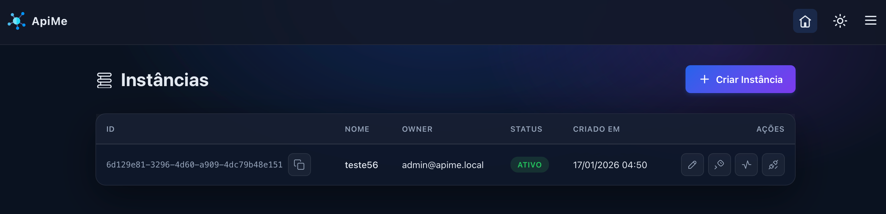
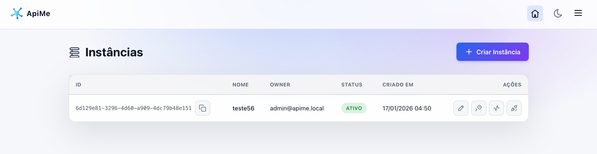

[🇧🇷 Leia em Português](README.md)

Go API to orchestrate multiple instances.

Based on the [WhatsMeow](https://github.com/tulir/whatsmeow) library with dashboard and Webhook events.




1. **Configure the environment:**
   ```bash
   cp .env.example .env
   ```
   *(Edit the `.env` as needed).*

2. **Start the containers:**
   ```bash
   docker compose up -d
   ```
   **Important:** Migrations and the initial admin user are created automatically on first boot.

## Access

- **Dashboard:** `http://localhost:8080/dashboard`
- **Email:** `admin@apime.local`
- **Password:** `admin123`


- **API Specification:** `openapi.yaml`
- **Documentation:** docs/


## ❤️ Support the project

If **apime** helped you, consider supporting the development:

### ₿ Bitcoin (BTC)
- **Address:** `1PR1ciDQ6wTLJ2WfCDE2AcXb4uAac1HbyQ`
