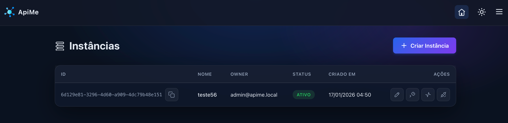
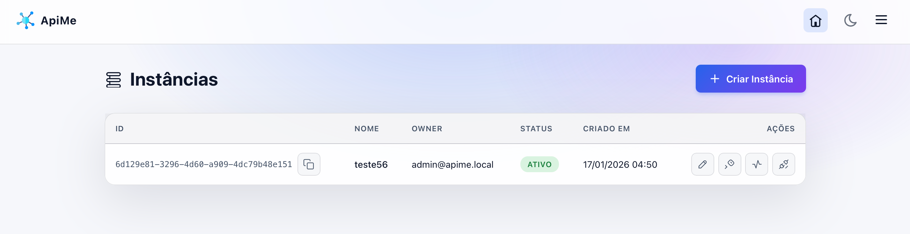

[🇺🇸 Read in English](README.en.md)

Api em Go para orquestrar múltiplas instâncias. 

Baseada na biblioteca [WhatsMeow](https://github.com/tulir/whatsmeow) com dashboard e eventos via Webhooks.




1. **Configurar o ambiente:**
   ```bash
   cp .env.example .env
   ```
   *(Edite o `.env` conforme necessário).*

2. **Iniciar os containers:**
   ```bash
   docker compose up -d
   ```
   **Importante:** As migrations e o usuário administrador inicial são criados automaticamente no primeiro boot.

## Acesso

- **Dashboard:** `http://localhost:8080/dashboard`
- **Email:** `admin@apime.local`
- **Senha:** `admin123`


- **API Specification:** `openapi.yaml`

## Documentação

| Doc | Assunto |
|---|---|
| [docs/dashboard.md](docs/dashboard.md) | interface web, autenticação e rotas de admin |
| [docs/webhook-payloads.md](docs/webhook-payloads.md) | envelope, assinatura HMAC e os tipos de evento |
| [docs/idempotency.md](docs/idempotency.md) | repetir envio sem duplicar mensagem |
| [docs/users.md](docs/users.md) | usuários e tokens |
| [docs/media.md](docs/media.md) | mídia |
| [docs/phone-numbers.md](docs/phone-numbers.md) | números e JIDs |
| [docs/whatsapp-advanced.md](docs/whatsapp-advanced.md) | grupos, newsletters e privacidade |
| [docs/health-check.md](docs/health-check.md) | health check |
